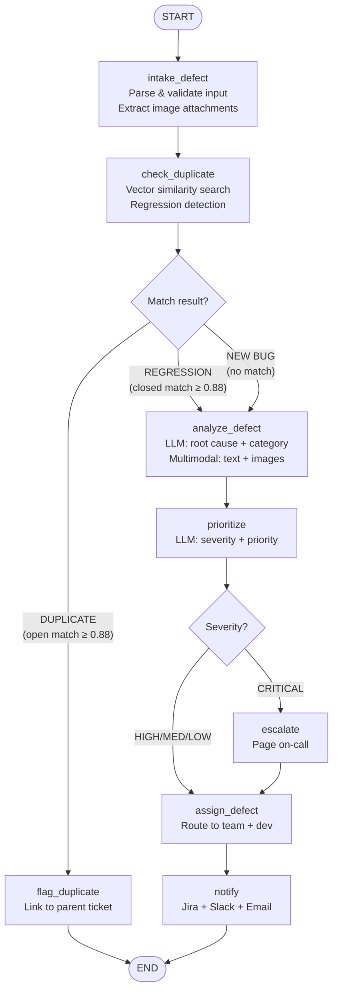

# Defect Triage AI Agent

## Table of Contents

1. [Project Overview](#1-project-overview)
2. [ADLC Phase 1 — Planning](#2-adlc-phase-1--planning)
3. [ADLC Phase 2 — Design](#3-adlc-phase-2--design)
4. [ADLC Phase 3 — Development](#4-adlc-phase-3--development)
5. [ADLC Phase 4 — Testing](#5-adlc-phase-4--testing)
6. [ADLC Phase 5 — Deployment](#6-adlc-phase-5--deployment)
7. [Risks & Mitigations](#7-risks--mitigations)
8. [References](#8-references)

---

## 1. Project Overview

**DefectTriageBot** automates the process of reviewing, prioritizing, and routing software bug reports using an LLM-powered LangGraph agent.

### Problem Statement

Manual defect triage is slow (~45 min/bug), inconsistent, and error-prone. Duplicate bugs clog the backlog, severity assignments vary by individual, and wrong team routing wastes developer time.

### Why Automation

| Problem | Impact |
|---------|--------|
| Manual severity assignment | ~45 min per bug |
| Duplicate bugs in backlog | ~18% of backlog |
| Wrong team routing | ~30% re-assignments |
| Delayed critical bug alerts | 4–8 hours response time |

### Expected Outcomes

| Metric | Target |
|--------|--------|
| Triage time | < 2 min/bug |
| Duplicate detection | < 3% slip-through |
| Critical bug alert | < 15 minutes |
| QA lead hours saved | ~10 hrs/sprint |

---

## 2. ADLC Phase 1 — Planning

### Goals

1. Ingest defects from Jira, GitHub Issues, or REST API
2. Analyze root cause and affected component using LLM
3. Detect duplicates via vector similarity
4. Classify severity: Critical / High / Medium / Low
5. Assign to the correct team and developer
6. Notify via Slack and email; update Jira ticket

### Scope

**In Scope**
- Defect ingestion, analysis, duplicate detection, severity classification, assignment, notification

**Out of Scope**
- Automated bug fixing, test case generation, UI dashboard (v1)

### Tools & Integrations

| Tool | Purpose |
|------|---------|
| Jira / GitHub Issues | Ticket management |
| Slack | Real-time notifications |
| ChromaDB / Pinecone | Vector store for duplicate detection |
| LangSmith | Tracing and evaluation |
| Anthropic Claude Sonnet 4.6 | Primary LLM |
| OpenAI text-embedding-3-small | Embeddings |

### LLM Rationale

Claude Sonnet 4.6 is selected for its 200k context window (handles large stack traces), reliable structured JSON output, and cost-effective throughput.

---

## 3. ADLC Phase 2 — Design

### LangGraph Flow



### State Schema

```python
class TriageState(TypedDict):
    # Input
    defect_id: str
    title: str
    description: str
    stack_trace: str
    environment: str
    reporter: str
    image_attachments: Annotated[list[dict], operator.add]  # [{media_type, data (base64)}]

    # Analysis
    category: str
    component: str
    root_cause: str

    # Duplicate / Regression detection
    is_duplicate: bool
    duplicate_of: str
    is_regression: bool   # True if match found but matched defect is RESOLVED/CLOSED
    regression_of: str    # ID of the previously resolved defect
    similar_defects: Annotated[list[dict], operator.add]

    # Triage
    severity: str       # CRITICAL | HIGH | MEDIUM | LOW
    priority: int       # 1 (highest) to 4 (lowest)

    # Assignment
    assigned_team: str
    assigned_to: str

    # Audit
    triage_notes: Annotated[list[str], operator.add]
    status: str
```

### Node Summary

| Node | Responsibility | LLM? |
|------|---------------|------|
| `intake_defect` | Parse and normalize input; extract image attachments from ticket | No |
| `check_duplicate` | Vector similarity vs. backlog; detect regression if match is RESOLVED/CLOSED | No |
| `analyze_defect` | Root cause, category, component; multimodal (text + base64 images) | Yes |
| `prioritize` | Severity and priority assignment | Yes |
| `assign_defect` | Component → team → developer routing | No |
| `escalate` | Page on-call for CRITICAL bugs | No |
| `flag_duplicate` | Link to parent, close as duplicate | No |
| `notify` | Jira update + Slack + Email | No |

---

## 4. ADLC Phase 3 — Development

### Tech Stack

| Layer | Technology |
|-------|-----------|
| Language | Python 3.11+ |
| Agent Framework | LangGraph 1.0+ |
| LLM | Anthropic Claude Sonnet 4.6 |
| Embeddings | OpenAI text-embedding-3-small |
| API Server | FastAPI |
| Vector Store | ChromaDB (local) / Pinecone (cloud) |
| Tracing | LangSmith |

### Project Structure

```
defect-triage-agent/
├── app/
│   ├── agent/
│   │   ├── graph.py          # StateGraph definition
│   │   ├── state.py          # TriageState schema
│   │   └── nodes/
│   │       ├── intake.py
│   │       ├── analyze.py
│   │       ├── duplicate.py
│   │       ├── prioritize.py
│   │       ├── assign.py
│   │       ├── escalate.py
│   │       ├── flag_dup.py
│   │       └── notify.py
│   ├── tools/
│   │   ├── jira_tool.py
│   │   ├── slack_tool.py
│   │   └── vector_store.py
│   └── api/
│       └── routes.py           # POST /triage + serves the React UI at /
├── frontend/                   # React 18 + Vite UI (post-v1 addition; thin client over /triage)
├── tests/
├── .env.example
├── Dockerfile
└── docker-compose.yml
```

> **Frontend (added beyond original v1 scope):** a React + Vite single-page UI in
> `frontend/` for submitting defects and viewing the triage result. Thin client over
> `POST /triage`; the backend serves the built app at `/`. See `frontend/README.md`.

### Core Graph Definition

```python
from langgraph.graph import StateGraph, START, END
from langgraph.types import RetryPolicy
from typing import Literal

def route_after_check(state) -> Literal["flag_duplicate", "analyze_defect"]:
    # Only skip analysis if it is a confirmed duplicate of an OPEN defect.
    # Regressions (is_regression=True) proceed to analyze_defect like new bugs.
    return "flag_duplicate" if state["is_duplicate"] else "analyze_defect"

def route_severity(state) -> Literal["escalate", "assign_defect"]:
    return "escalate" if state["severity"] == "CRITICAL" else "assign_defect"

def build_graph():
    builder = StateGraph(TriageState)

    # Register nodes — check_duplicate runs BEFORE analyze_defect
    builder.add_node("intake_defect", intake_defect)
    builder.add_node("check_duplicate", check_duplicate)
    builder.add_node("analyze_defect", analyze_defect,
                     retry_policy=RetryPolicy(max_attempts=3))
    builder.add_node("prioritize", prioritize,
                     retry_policy=RetryPolicy(max_attempts=3))
    builder.add_node("assign_defect", assign_defect)
    builder.add_node("escalate", escalate)
    builder.add_node("flag_duplicate", flag_duplicate)
    builder.add_node("notify", notify)

    builder.add_edge(START, "intake_defect")
    builder.add_edge("intake_defect", "check_duplicate")   # duplicate check first

    # Duplicates short-circuit to flag_duplicate; regressions and new bugs go to analyze
    builder.add_conditional_edges("check_duplicate", route_after_check,
                                  ["flag_duplicate", "analyze_defect"])
    builder.add_edge("analyze_defect", "prioritize")
    builder.add_conditional_edges("prioritize", route_severity,
                                  ["escalate", "assign_defect"])

    builder.add_edge("escalate", "assign_defect")
    builder.add_edge("assign_defect", "notify")
    builder.add_edge("notify", END)
    builder.add_edge("flag_duplicate", END)

    return builder.compile()
```

### Sample Node — `check_duplicate`

```python
SIMILARITY_THRESHOLD = 0.88
RESOLVED_STATUSES = {"RESOLVED", "CLOSED", "DONE"}

def check_duplicate(state: TriageState) -> dict:
    query = f"{state['title']} {state['description']}"
    results = get_vector_store().similarity_search_with_score(query, k=5)

    for doc, score in results:
        if score < SIMILARITY_THRESHOLD:
            continue
        matched_status = doc.metadata.get("status", "").upper()
        matched_id = doc.metadata.get("defect_id", "")

        if matched_status in RESOLVED_STATUSES:
            # Previously fixed defect is resurfacing — treat as regression
            return {
                "is_duplicate": False,
                "duplicate_of": "",
                "is_regression": True,
                "regression_of": matched_id,
                "status": "in_triage",
                "triage_notes": [f"[check_duplicate] REGRESSION of resolved defect {matched_id}"],
            }
        else:
            # Active duplicate found — skip LLM analysis entirely
            return {
                "is_duplicate": True,
                "duplicate_of": matched_id,
                "is_regression": False,
                "regression_of": "",
                "status": "duplicate",
                "triage_notes": [f"[check_duplicate] DUPLICATE of open defect {matched_id}"],
            }

    return {
        "is_duplicate": False, "duplicate_of": "",
        "is_regression": False, "regression_of": "",
        "status": "in_triage",
        "triage_notes": ["[check_duplicate] No match found — new defect"],
    }
```

### Sample Node — `analyze_defect` (Multimodal)

```python
def analyze_defect(state: TriageState) -> dict:
    regression_note = (
        f"[REGRESSION] This defect matches previously resolved issue {state['regression_of']}. "
        "Focus on what may have regressed.\n"
        if state.get("is_regression") else ""
    )

    # Build multimodal content: text block first, then any image attachments
    content = [
        {
            "type": "text",
            "text": (
                f"{regression_note}"
                f"Analyze this defect and return JSON with category, component, and root_cause.\n\n"
                f"Title: {state['title']}\n"
                f"Description: {state['description']}\n"
                f"Stack Trace: {state.get('stack_trace') or 'N/A'}"
            ),
        }
    ]
    for img in state.get("image_attachments", []):
        content.append({
            "type": "image",
            "source": {
                "type": "base64",
                "media_type": img["media_type"],   # e.g. "image/png"
                "data": img["data"],               # base64-encoded string
            },
        })

    response = llm.invoke([HumanMessage(content=content)])
    data = json.loads(response.content)

    prefix = "[REGRESSION] " if state.get("is_regression") else ""
    return {
        "category": data["category"],
        "component": data["component"],
        "root_cause": data["root_cause"],
        "triage_notes": [f"{prefix}[analyze_defect] {data['category']} in {data['component']}"],
    }
```

---

## 5. ADLC Phase 4 — Testing

### Strategy

| Level | Tool | Focus |
|-------|------|-------|
| Unit | pytest + mock | Each node in isolation |
| Integration | pytest (live) | Full graph end-to-end |
| LLM Eval | LangSmith | Severity accuracy |

### Sample Test Scenarios

| Scenario | Expected Severity | Expected Route |
|----------|------------------|----------------|
| Payment service down (prod, all users) | CRITICAL | Check Dup → Analyze → Escalate → Assign → Notify |
| Button misaligned in staging | LOW | Check Dup → Analyze → Assign → Notify |
| Duplicate of open DEF-101 | N/A | Flag Duplicate → END (LLM skipped) |
| Same symptoms as CLOSED DEF-050 | HIGH | Check Dup → Analyze (regression) → Assign → Notify |
| Screenshot attached showing UI glitch | LOW | Analyze (multimodal) → Assign → Notify |

### Evaluation Metrics

| Metric | Target |
|--------|--------|
| Severity accuracy | ≥ 90% |
| Duplicate precision | ≥ 95% |
| Assignment accuracy | ≥ 85% |
| Avg. triage latency | < 10 seconds |

---

## 6. ADLC Phase 5 — Deployment

### Deployment Options

| Option | How |
|--------|-----|
| Local | `uvicorn app.api.routes:app --reload` |
| Docker | `docker build + docker run --env-file .env` |
| Docker Compose | `docker compose up -d` (agent + ChromaDB) |

### Key Environment Variables

```env
ANTHROPIC_API_KEY=...
OPENAI_API_KEY=...
JIRA_BASE_URL=https://your-org.atlassian.net
JIRA_API_TOKEN=...
SLACK_WEBHOOK_URL=...
LANGSMITH_API_KEY=...
LANGCHAIN_TRACING_V2=true
```

### Monitoring

| Tool | Purpose |
|------|---------|
| LangSmith | LLM traces, latency, token usage |
| structlog | Structured JSON logs per node |
| Sentry | Unhandled exceptions |

---

## 7. Risks & Mitigations

| Risk | Mitigation |
|------|-----------|
| LLM incorrect severity | Rule-based override for known CRITICAL keywords |
| Duplicate false positive | Human review for similarity score 0.80–0.88 |
| Regression misidentified as new bug | Track defect status in vector store metadata; refresh on ticket close/resolve |
| Large image attachments slowing triage | Cap image size (max 5 MB per image, max 3 images); strip unsupported formats |
| Jira API rate limiting | Exponential backoff + request queue |
| LLM provider outage | Fallback to rule-based classifier |
| PII in bug reports or screenshots | PII scrubber on text; avoid logging raw image data |

---

## 8. References

- [LangGraph Documentation](https://langchain-ai.github.io/langgraph/)
- [LangGraph StateGraph API](https://langchain-ai.github.io/langgraph/reference/graphs/)
- [LangSmith Tracing](https://docs.smith.langchain.com/)
- [Jira REST API v3](https://developer.atlassian.com/cloud/jira/platform/rest/v3/)
- [GitHub Issues API](https://docs.github.com/en/rest/issues)
- [ChromaDB Documentation](https://docs.trychroma.com/)
